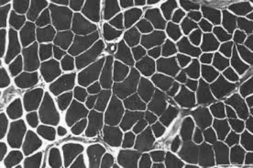
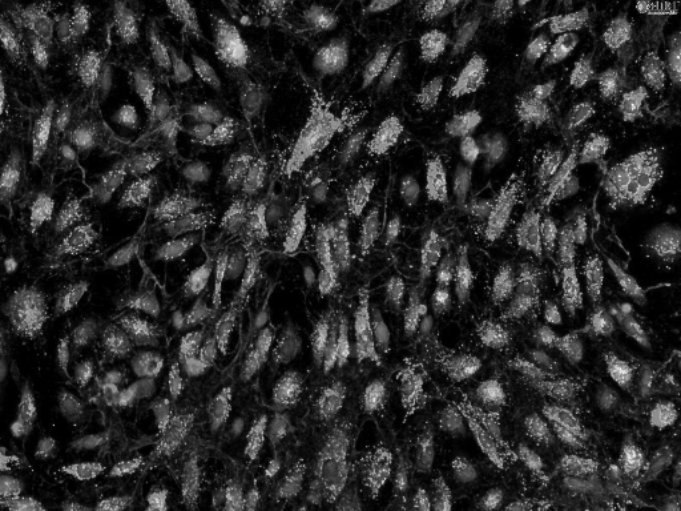
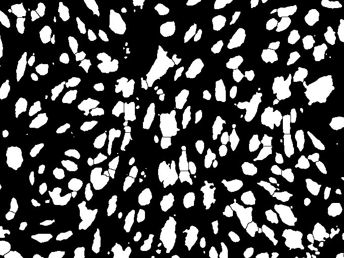
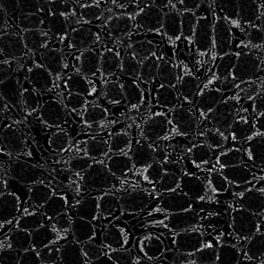
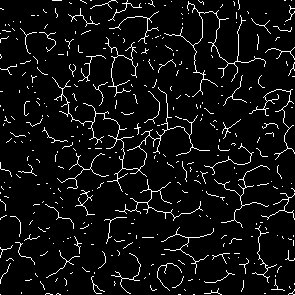

# Fiji MCP Server

[](https://www.python.org/downloads/)
[](https://pypi.org/project/fiji-mcp-server/)
[](https://opensource.org/licenses/BSD-3-Clause)
[](https://github.com/surajinacademia/Fiji_imageJ_mcp/actions/workflows/ci.yml)

> **What is this?** A small **MCP server** so assistants in **Cursor**, **Claude Desktop**, **Claude Code**, **Gemini CLI**, **Windsurf**, and similar apps can drive **Fiji / ImageJ** in plain language: open your images, run ImageJ macros, search commands, grab screenshots for proof, and chain steps into workflows—without you hand-writing boilerplate or clicking the same menus every time.

Under the hood it uses [**Model Context Protocol**](https://modelcontextprotocol.io/), [**PyImageJ**](https://pyimagej.readthedocs.io/), and [**FastMCP**](https://github.com/jlowin/fastmcp) over **stdio**, so the same install works across MCP hosts.

---

## See it running

Below are **three** reproducible demos on images shipped in this repo. Each row is one headless Fiji run: open a sample → process or measure → save a screenshot to `demo_output/`.

| # | In plain words | What Fiji is doing |
|---|----------------|-------------------|
| **1** | **Soften a noisy image** | Gaussian blur (gentle denoising–style filter). |
| **2** | **Find bright “blobs” and size them** | Threshold, separate touching objects, outline each object, then a tiny **Area / circularity** table (numbers only—no giant screenshot). |
| **3** | **Turn shapes into stick figures and count branches** | Mask → **Skeletonize** → **Analyze Skeleton (2D/3D)** metrics per tree. |

Screenshots use **paths relative to the repo** (`./demo_output/…`). If images look missing locally, run:

`FIJI_PATH=<your Fiji app folder> FIJI_MODE=headless python scripts/generate_readme_demo_assets.py`

<details>
<summary><strong>Where do names like <code>img07.png</code> come from?</strong></summary>

They are just short filenames under <code>demo_images/</code> used by the maintainer scripts—you do not need to memorize them. In chat you can say <em>“open the sample fluorescence image in <code>demo_images/</code>”</em> and point at any file there; the table above maps <strong>what you see</strong> → <strong>which pipeline</strong> for this README only.
</details>

### Gallery (same three ideas as the table)

<p align="center">
  <table>
    <tr>
      <th align="center" colspan="2">1 · Softening filter<br><sub>Before / after blur on a bundled 2D sample</sub></th>
    </tr>
    <tr>
      <td align="center" width="50%">
        <a href="./demo_output/readme_ex01_img07_input.jpg">
          
        </a>
        <p align="center"><em>Original</em></p>
      </td>
      <td align="center" width="50%">
        <a href="./demo_output/readme_ex01_img07_processed.jpg">
          
        </a>
        <p align="center"><em>After Gaussian blur</em></p>
      </td>
    </tr>
    <tr>
      <th align="center" colspan="2">2 · Objects and outlines<br><sub>Threshold + particle overlay (headless-safe Java analyzer)</sub></th>
    </tr>
    <tr>
      <td align="center" width="50%">
        <a href="./demo_output/readme_ex02_img10_input.jpg">
          
        </a>
        <p align="center"><em>Input</em></p>
      </td>
      <td align="center" width="50%">
        <a href="./demo_output/readme_ex02_img10_overlay.jpg">
          
        </a>
        <p align="center"><em>Outlined objects</em></p>
      </td>
    </tr>
    <tr>
      <th align="center" colspan="2">3 · Skeleton summary<br><sub>Binary mask → skeleton → branch / junction style metrics</sub></th>
    </tr>
    <tr>
      <td align="center" width="50%">
        <a href="./demo_output/readme_ex03_img12_input.jpg">
          
        </a>
        <p align="center"><em>Input</em></p>
      </td>
      <td align="center" width="50%">
        <a href="./demo_output/readme_ex03_img12_skeleton.jpg">
          
        </a>
        <p align="center"><em>Skeleton (midline of shapes)</em></p>
      </td>
    </tr>
  </table>
</p>

### Numbers for demos 2 and 3

Small **markdown** tables (not images). Regenerate from Fiji with  
`FIJI_PATH=… FIJI_MODE=headless python scripts/generate_readme_demo_assets.py`  
(add `UPDATE_README_TABLES=0` if you do not want this file edited).

#### Demo 2 — first few objects (area & roundness)

<!-- readme-demo-table:ex2-particles -->
| # | Area | Circ. |
| ---: | ---: | ---: |
| 1 | 1052 | 0.89 |
| 2 | 2840 | 0.72 |
| 3 | 641 | 0.91 |
| 4 | 1902 | 0.68 |

*Sample of the full table; numbers refresh when you run the asset script.*
<!-- /readme-demo-table:ex2-particles -->

#### Demo 3 — skeleton trees (excerpt)

<!-- readme-demo-table:ex3-skeleton -->
| Tree | # Branches | # Junctions |
| ---: | ---: | ---: |
| 1 | 14 | 6 |
| 2 | 9 | 7 |

*First trees only; more rows exist in a full Fiji run.*
<!-- /readme-demo-table:ex3-skeleton -->

---

## Get started

| Step | What to do |
|------|------------|
| **1 · Install** | **From PyPI:** `pip install fiji-mcp-server` — or clone and run **`python3 scripts/install_fiji_mcp.py`** / **`./install.sh`** for an editable dev tree. Needs **Python 3.10+**, a local [**Fiji**](https://fiji.sc/) folder (`jars/` + `plugins/`), and **Java** for PyImageJ. |
| **2 · Wire your app** | `source .venv/bin/activate` then **`fiji-mcp-install install cursor --fiji-path /path/to/Fiji`** (or `claude-desktop`, `gemini`, …). Restart the host app. |
| **3 · Check** | In chat: *“Run the Fiji MCP `health_check` tool.”* Optional: `FIJI_PATH=… FIJI_MODE=headless python scripts/demo_fiji_mcp_session.py` |

**Full detail:** [**docs/quickstart.md**](docs/quickstart.md)

**Optional — terminal smoke + optional Fiji.app (macOS):** `python scripts/mcp_and_gui_fiji.py` from the repo root (auto-picks Fiji and a demo image when it can). Flags and behavior: [**docs/quickstart.md** — MCP + GUI](docs/quickstart.md#mcp-and-gui-fiji).

**Regenerate** the gallery JPEGs and the two small tables:  
`FIJI_PATH=… FIJI_MODE=headless python scripts/generate_readme_demo_assets.py`

> **Related projects:** installer pattern inspired by [**napari-mcp**](https://napari-hub.org/plugins/napari-mcp.html) · sibling [**cellpose_mcp**](https://github.com/surajinacademia/cellpose_mcp) · **[ssahu2@ucmerced.edu](mailto:ssahu2@ucmerced.edu)**.

### Configure your AI app

After install, run **`fiji-mcp-install install <target> --fiji-path <ABS>`** so the host launches **`python -m fiji_mcp`** with your Fiji path (same pattern as [cellpose_mcp](https://github.com/surajinacademia/cellpose_mcp)).

| Application | Command | Notes |
| ----------- | ------- | ----- |
| **Cursor** | `fiji-mcp-install install cursor --fiji-path <ABS>` | Writes `~/.cursor/mcp.json` |
| **Claude Desktop** | `fiji-mcp-install install claude-desktop --fiji-path <ABS>` | Claude Desktop `mcpServers` |
| **Claude Code** (user) | `fiji-mcp-install install claude-code --fiji-path <ABS>` | Merges into `~/.claude.json` |
| **Claude Code** (project) | `fiji-mcp-install install claude-code --fiji-path <ABS> --project <DIR>` | Creates or updates `<DIR>/.mcp.json` |
| **Gemini CLI** | `fiji-mcp-install install gemini --fiji-path <ABS>` | Merges into `~/.gemini/settings.json` |
| **Windsurf** | `fiji-mcp-install install windsurf --fiji-path <ABS>` | `~/.codeium/windsurf/mcp_config.json` |

**Options:** `--mode gui|headless|auto|smart` (default **`headless`** for IDE/CLI stability); `--command /path/to/fiji-mcp-server` if the host app does not see your venv on `PATH`.

<details>
<summary><strong>Manual configuration</strong> (any MCP host)</summary>

Use the Python that has `fiji-mcp-server` / `fiji_mcp` installed:

```json
{
  "mcpServers": {
    "fiji": {
      "command": "/path/to/venv-or-conda/bin/python",
      "args": ["-m", "fiji_mcp"],
      "env": {
        "FIJI_PATH": "/Applications/Fiji",
        "FIJI_MODE": "headless",
        "PYTHONUNBUFFERED": "1"
      }
    }
  }
}
```

For **Cursor**, use the same object in `~/.cursor/mcp.json` or project `.cursor/mcp.json`. Under **stdio**, do not use ImageJ `print()` in macros (stdout must stay JSON-clean).

</details>

After you configure, **restart** the host app, then try prompts like these (same spirit as [cellpose_mcp](https://github.com/surajinacademia/cellpose_mcp)):

```
"Run the Fiji MCP health_check tool."
"Search ImageJ commands matching 'Gaussian blur'."
"Open a PNG from ./demo_images/, apply Gaussian blur with sigma 4, and show me an active_image screenshot."
```

## 🎯 What Can You Do?

### Basic macros and I/O

```
"Open ./demo_images/sample_gradient.pgm and report width and height."
"Run a macro that applies Gaussian blur then runs Measure."
"Save the active image to ./out/result.tif."
```

### Discovery and screenshots

```
"List extensions loaded in this Fiji session."
"Search commands matching 'FFT'."
"Capture results_table after Measure on the current image."
```

### Multi-step workflows

```
"Use run_workflow so each step runs a macro and optionally screenshots the active image after Gaussian blur."
"Open a sample from ./demo_images/, build a mask, skeletonize it, and summarize branch-style metrics."
```

### Batch and reporting

```
"Run generate_image_analysis_report-style steps on all PNGs under ./demo_images/."
```

Use **`scripts/generate_image_analysis_report.py`** for a long stdio-MCP batch run; it writes **`research_output/`** and a report under **`docs/`** (both **gitignored** so your clone stays light). See [**Batch report workflow**](docs/batch_report_workflow.md).

For a **short** stdio check (and optional **Fiji.app** on macOS), use **`scripts/mcp_and_gui_fiji.py`** — [quickstart](docs/quickstart.md#mcp-and-gui-fiji).

## 🛠 Available MCP Tools

The server exposes **19** tools for Fiji/ImageJ automation:

### Macros and images

- **`health_check`** — Verify Fiji / PyImageJ readiness  
- **`run_macro`** — Execute ImageJ macro text (with retries)  
- **`run_batch_macros`** — Run several macros with optional MCP progress  
- **`open_image`** / **`save_image`** — Path-aware I/O with optional `FIJI_DATA_ROOTS` allowlist  

### Screenshots

- **`screenshot_fiji`** — `full_screen`, `active_image`, or `results_table`  

### Discovery

- **`list_all_commands`** / **`search_commands`** / **`describe_plugin`**  
- **`list_extensions`** / **`list_open_images`** / **`get_image_info`**  

### Workflows and session helpers

- **`run_workflow`** — Async multi-step pipelines  
- **`parse_macro_output`**, **`compare_screenshots`**, **`list_macro_templates`**, **`get_macro_template`**  
- **`get_session_trace`** / **`clear_session_trace`**  

## 📖 Documentation

| Resource | Description |
| -------- | ----------- |
| [**Install & quick start**](docs/quickstart.md) | Clone, venv, `pip install`, auto/manual MCP setup, verify |
| [**MCP Tools**](docs/tools.md) | Full tool tables and parameters |
| [**Configuration**](docs/configuration.md) | Env vars, troubleshooting, Cursor plugin |
| [**Architecture**](docs/architecture.md) | Package layout and data flow |
| [**Batch report**](docs/batch_report_workflow.md) | Stdio MCP batch report script |

**Local doc site:** `npx docsify serve docs` then open the URL shown (same Docsify pattern as [cellpose_mcp/docs](https://github.com/surajinacademia/cellpose_mcp/tree/main/docs)).

**Changelog & releases:** [**CHANGELOG.md**](CHANGELOG.md) · [**RELEASING.md**](RELEASING.md) (PyPI / GitHub Releases) · [**RELEASE_NOTES_v0.1.1.md**](RELEASE_NOTES_v0.1.1.md) · [**CLAUDE.md**](CLAUDE.md) · **Pre-commit:** `.pre-commit-config.yaml` (`pip install -e ".[dev]" && pre-commit install`)

## 📋 Architecture

- **FastMCP** — stdio JSON-RPC to your AI client  
- **PyImageJ / JPype** — JVM bridge into Fiji/ImageJ2  
- **Tool modules** — `macro_runner`, `discovery`, `screenshot`, `workflow`, `structured_tools`  
- **Design** — Headless-first for MCP; optional GUI + Robot for `full_screen`; stdio-safe macros (no `print()` to stdout)  

**Project status:** Phases 1–4 complete; phase 5 (integration polish) in progress — see [**plan.md**](plan.md). CI: `pytest -m "not integration"` on Python 3.10–3.12.

---

**Author:** Suraj Sahu  
**Affiliation:** Department of Physics, University of California Merced, CA, USA  
**Email:** [ssahu2@ucmerced.edu](mailto:ssahu2@ucmerced.edu)

## 📄 License

BSD-3-Clause — see [**LICENSE**](LICENSE).

## 🙏 Acknowledgments

- [**Napari MCP**](https://github.com/royerlab/napari-mcp) (royerlab) — installer and MCP patterns  
- [**ImageJ2**](https://imagej.net/software/imagej2) / [**PyImageJ**](https://pyimagej.readthedocs.io/)  
- [**FastMCP**](https://github.com/jlowin/fastmcp)  
- [**Anthropic**](https://www.anthropic.com/) and the [**Model Context Protocol**](https://modelcontextprotocol.io/)  

---
